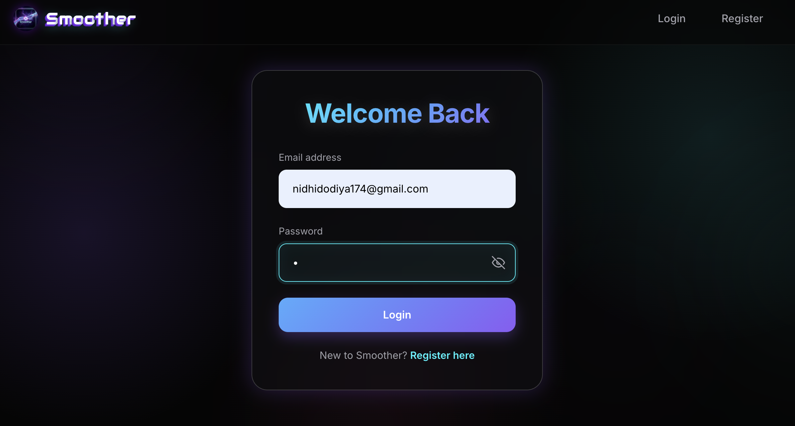
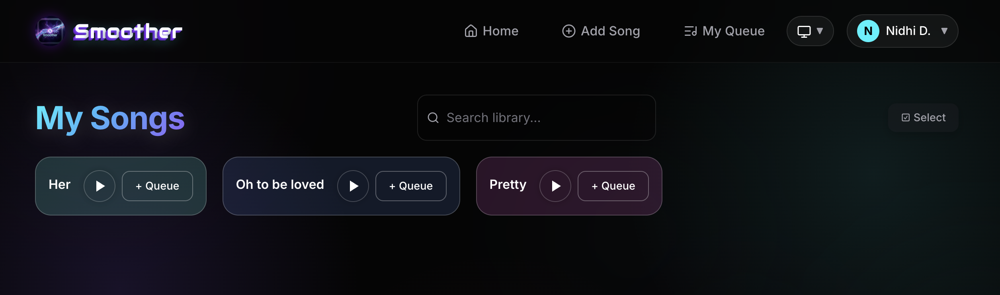

# 🎵 Smoother — Offline-First Music Streaming & Library

Smoother is a glassmorphic music web application that lets you build a personalized, offline-capable library from YouTube links and playlists, with dynamic neon themes and an ambient web player.

---

## 📸 Walkthrough: How the Website Works

### 1. Secure Authentication
Users sign up or log in to manage their private music collection safely via secure JWT credentials.

---

### 2. Main Dashboard & Library Themes
The dashboard fetches your tracks and lets you customize cards with randomized or curated glowing themes.

---

### 3. Expanded Media Player
Clicking a song card opens the media player card, showing title editor, progress slider, volume controls, and download actions.

---

### 4. Adding Tracks & Background Download Queue
Paste a YouTube URL to automatically extract and upload files. The progress of background operations is shown in the active downloads panel.

---

### 5. Managing Your Play Queue
Add songs to your active session list, toggle looping, and play or clear tracks sequentially.

---

### 6. Profile Management
The profile section displays user account details, library statistics, and lets you update your name or change your password.

---

### 7. Saving Offline
Click **Save Offline** on the player to trigger the Service Worker cache, allowing you to stream tracks without an internet connection.

---

## 🚀 Key Features

*   **⚡ YouTube & Playlist Importer**: Extracts high-quality audio streams from YouTube via the server and transcodes them to MP3.
*   **☁️ Cloud Integration**: Saves music files on Cloudinary and maps metadata records to MongoDB.
*   **⏳ Background Queue**: Displays real-time download/processing states (`queued` ⏳, `downloading` ⬇️, `uploading` ☁️, `done` ✅).
*   **🎨 Customizable Neon Themes**: Offers modern glassmorphic library cards with customized or random glowing neon styles.
*   **📥 Offline Caching**: Uses a Service Worker to cache songs locally in the browser for offline listening.
*   **📋 Interactive Queue**: Lets you build active play queues, toggle looping, and easily manage upcoming tracks.

---

## 🛠️ Technology Stack

*   **Frontend**: React 19, Vite, React Router v7, Bootstrap, Service Worker API, Axios, Lucide React.
*   **Backend**: Node.js, Express, MongoDB & Mongoose, Fluent-FFmpeg, yt-dlp, Cloudinary SDK, JWT, Bcrypt.

---

## ⚙️ Installation & Setup

### 📁 Backend Setup (`/server`)
1. Run `npm install` inside the `/server` directory.
2. Setup a `.env` file with `PORT`, `MONGO_URI`, `JWT_SECRET`, `CLOUDINARY_CLOUD_NAME`, `CLOUDINARY_API_KEY`, `CLOUDINARY_API_SECRET`, and `FRONTEND_URL`.
3. Launch with `npm run dev`.

### 💻 Frontend Setup (`/client`)
1. Run `npm install` inside the `/client` directory.
2. Setup a `.env` file containing `VITE_API_URL`.
3. Start the dev server using `npm run dev` and navigate to `http://localhost:5173`.
